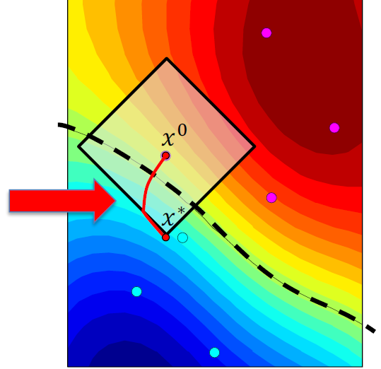

# Projected Gradient Descent (PGD) Attack


Here, I provide my custom implementation of the PGD attack, incorporating various optimizers and learning rate schedulers.  
Specifically, this is an untargeted PGD attack using the 𝐿∞ norm.

  
*Biggio, B., et al. (2013). Evasion attacks against machine learning at test time.*
## Dependencies
Instead of providing users with each separate dependency, I provide the entire environment file.

```sh
name: pgd
channels:
  - pytorch
  - nvidia
  - conda-forge
  - defaults
dependencies:
  - pip=23.2.1
  - python=3.11.5
  - pytorch=2.0.1
  - torchvision=0.15.2
  - pip:
      - git+https://github.com/RobustBench/robustbench.git
```
> **NOTE:** The environment file must be saved under the extension .yml!

To create the desired environment, type this command in the Anaconda terminal:
```shell
conda env create -f env.yml
```

## Running experiments
Before executing main_func.py, one should choose which model, dataset, scheduler, and optimizer to use.

#### Configuration
```json
{
    "seed": 1233,
    "experiments": [
        {
            "dataset": "cifar10",
            "model": "carmon2019",
            "n_samples": 100,
            "batch_size": 4,
            "attack_name": "PGD",
            "attack_steps": 40,
            "epsilon": 8,
            "optimizer": "Adam",
            "scheduler": "multistep"
        }
    ]
}
```

Experiments are run by calling main function:
```sh
python main_func.py --device=cuda --config=configs/config_pgd.json
```
