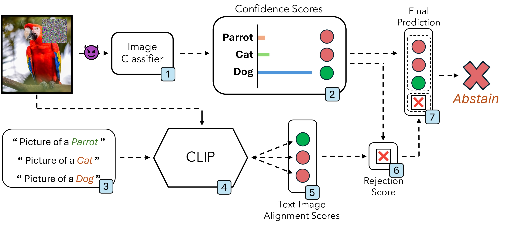

# Multi-Shield: Robust Image Classification with Multi-Modal Large Language Models


Here we give an explanation of the Robust Image Classiffier we have developed. In a nutshell, Multi-Shield is a novel defensive mechanism that leverages multi-modal data, specifically visual and textual inputs, to identify and reject adversarial examples.


## Mutli-Shield Classification
####  It operates in three distinct phases:

##### 1. Unimodal classification:
- The Multi-Shield workflow begins with the image classifier processing the input (Step 1) and generating confidence scores for each class in the dataset (Step 2). Based on these scores, an initial prediction is made, relying solely on the image classifier’s output.
##### 2. Multi-Modal alignment:
- In this second phase, Multi-Shield uses the CLIP model as a zero-shot vision-language classifier. It compares the visual representation of the input image with class description prompts to determine alignment. For each class, we first create natural language prompts in the format ‘Picture of a [object]’ (Step 3).
- During prediction, these prompts, along with the input image, are processed through CLIP’s dual encoders: one for images and one for text (Step 4). This process generates visual and textual embeddings that capture the features of both modalities, with CLIP aiming to maximize the alignment between the image and the textual description that best matches it.
- Finally, Multi-Shield computes the alignment scores using cosine similarity, selecting the class with the highest score as the final prediction from the CLIP model (Step 5).
##### 3. Multi-Shield Final Decision
- In the final phase, Multi-Shield compares the predictions from the unimodal image classifier and the multimodal CLIP model (Step 6), each capturing distinct patterns in the data. If both models agree, Multi-Shield outputs their shared prediction; if not, it abstains (Step 7).

### Multi-Shield in Clean scenario (i.e., no adversarial perturbation is applied)

### Multi-Shield in Adversarial scenario (i.e., adversarial perturbation is applied)

## Dependencies
Instead of providing users with each separate dependency, we provide our entire environment file.

```sh
name: multishield
channels:
  - pytorch
  - nvidia
  - conda-forge
  - defaults
dependencies:
  - pip=23.2.1
  - python=3.11.5
  - pytorch=2.0.1
  - torchvision=0.15.2
  - tqdm=4.66.1
  - pip:
      - git+https://github.com/RobustBench/robustbench.git
      - git+https://github.com/jeromerony/adversarial-library
      - git+https://github.com/Harry24k/adversarial-attacks-pytorch.git
      - eagerpy==0.30.0
      - foolbox==3.3.3
      - scipy==1.11.2
      - numba==0.58.0
      - open_clip_torch==2.29.0
      - transformers==4.46.3
```
> **NOTE:** The environment file must be saved under the extension .yml!

To create the desired environment, type this command in the Anaconda terminal:
```shell
conda env create -f env.yml
```

## Code Folding
The code is structured as follows:

- configs/, where experimental configurations are stored.
- ingredients/, contains useful functions regarding datasets and models.
     1. datasets.py, used to load datasets.
     2. models.py, used to load models. 
     3. utilities.py, contains useful functions to run experiments.
- models/, where models are downloaded and stored.
     1. CLIP.py, implementation of CLIP model.
     2. MultiShield.py, implementation of our Multi-Shield defense.
- results/, contains the results of the experiments created by the main script.
- env.yml, all the required dependencies. 
- main.py, executes experiment in {args.config} on device {args.device}.
- modified_autoattack.py, modified version of autoattack.py file sourced from RobustBench.
- modified_autopgd_base.py, modified version of autopgd_base.py file sourced from RobustBench.


## Running experiments
Before executing main_func.py, one should choose which model, dataset, and CLIP version to use. There are two possible datasets: CIFAR-10 and ImageNet, along with models corresponding to both datasets. That being said, there are two different configuration files. Here are two examples: one for the CIFAR-10 dataset and one for the ImageNet dataset.

#### CIFAR-10
```json
{
    "seed": 1233,
    "experiments": [
        {
            "clip_model_id":"tangake_finetuned",
            "dataset": "cifar10",
            "model": "carmon2019",
            "n_samples": 4000,
            "batch_size": 64
        }
    ]
}
```

#### ImageNet
```json
{
    "seed": 1233,
    "experiments": [
        {
            "clip_model_id":"clipa_ViT_L",
            "dataset": "imagenet",
            "model": "liu2023",
            "n_samples": 3200,
            "batch_size": 32
        }
    ]
}
```

Experiments are run by calling main function:
```sh
python main.py --device=cuda --config=configs/config_clip.json
```
> **NOTE:** One can choose on which device to run experiments(i.e., cpu or cuda).

After executing the main function, experimental results will be saved in the /results folder.

## Acknowledgements
The authors would like to thank to [RobustBench](https://github.com/RobustBench/robustbench) for providing us with the materials we needed to conduct our research.
